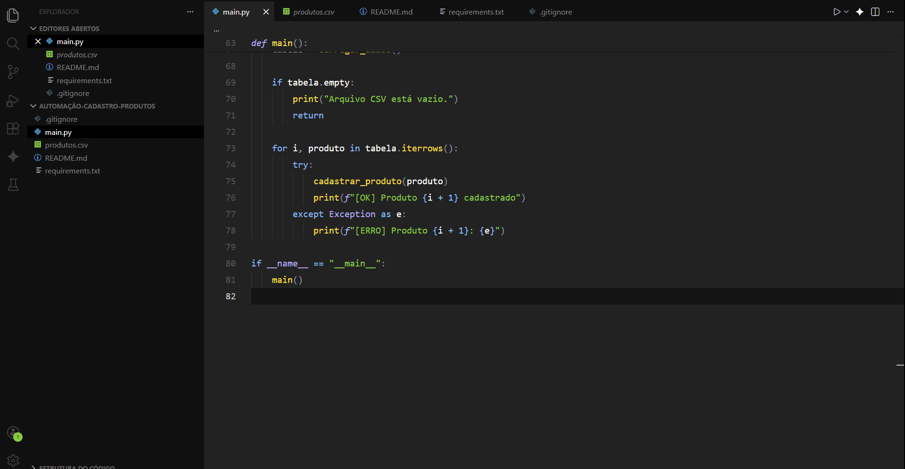

# Automação de Cadastro de Produtos

Projeto de automação desenvolvido em Python para realizar o cadastro automático de produtos em um sistema web, a partir de uma base de dados em CSV.

## Demonstração




## Funcionalidades
- Abertura automática do navegador
- Login automatizado no sistema
- Leitura de arquivo CSV
- Preenchimento e envio de formulários
- Cadastro sequencial de produtos

## Tecnologias Utilizadas
- Python
- PyAutoGUI
- Pandas

## Como executar

1. Clone o repositório:
```bash
git clone https://github.com/seu-usuario/automacao-cadastro-produtos.git
```
2. Instale as dependências:
```bash
pip install -r requirements.txt
```
3. Execute o script:
```bash
python main.py
```

## Observações
- As coordenadas de clique dependem da resolução de tela
- Projeto com foco educacional e demonstrativo

## Desenvolvido por Matheus Henrique

